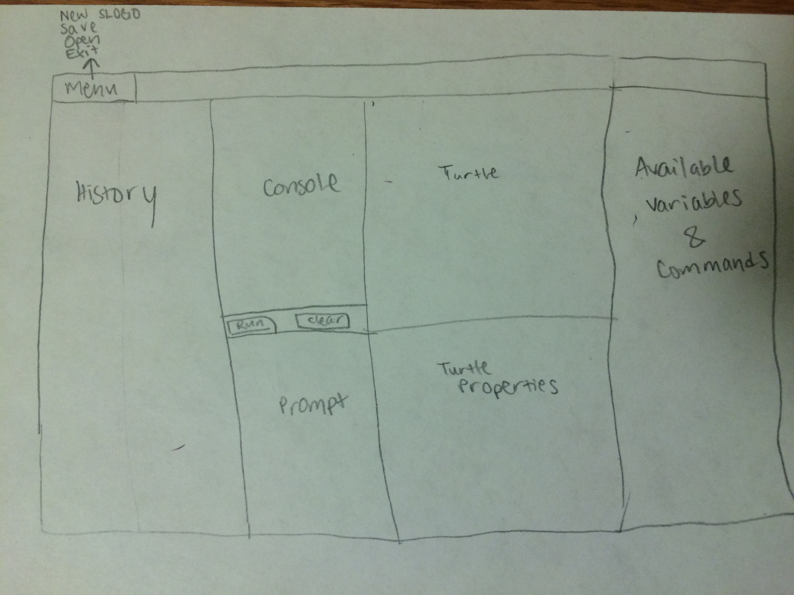

#SLogo Team 8 Design

###User Interface
Our user interface will be composed of several parts: a console for the user to enter commands, a prompt that displays error messages when the user inputs bad data, a Turtle Scene that displays the movements of the turtle, an area to set turtle properties, a menu panel to save and open SLogo files and create new SLogo files, an area displaying history of commands executed, and an area for displaying available variables and commands. The latter two components will be interactive, clickable text areas to easily input into the console. Below is a model of how we will design our user interface:

## Design Details##
**Backend Overview**
We plan to have four main APIs for the back end, A model external API, model internal API, command internal API and a command external API. These APIs represent the two major sections of the back end: the controller and the model. The hub will call the Command API external and use that information to call the valid model API command. The event handler in the GUI will track when modifications have been made via the Model API and update the GUI when that occurs. 

 - Model API: The main purpose of the model APIs is to allow the view and the controller to access and modify the simulation data respectively. We’re unsure what internal commands the model API will need at this point but will leave its existence intact due to future extensions. 
 - External Command API: allow the other classes to access the parsed command and return the updated model object. 
 - Internal Command API: Conducts parsing and internal logic of the Slogo language. 

There are a few major design points necessary for this portion of the project to be successful. 
1.	There needs to be a good way to add new commands, turtle functions and data modifications. We want to use a strategy design pattern or a reflection design pattern to map strings to commands and map commands to functionalities 
2.	There needs to be a flexible way of accounting for extensions in the number of objects being modified. In the data object, instead of having one instance of turtle we will have an array list of objects that can hold the ids of many things. 
3.	There needs to be a good way of storing variables and referencing variables via commands. There will probably be an arraylist of variables inside the controller class as well as necessary inputs for each of the command classes. 

**Classes**

 - Controller.java: responsible for holding the instance of the parser class and conducting logic	
 - Parser.java: responsible for parsing commands. Will return, lines of slogo code
 - Command.java- super class responsible for abstract commands
 - Turtle Commands- return a turtle modification
 - Turtle Query Command- return an integer about turtle status
 - Math Operation Command- return the result
 - Boolean Command- returns a Boolean
 - Display command- returns a display modification
 - Object.java- superclass for turtle and turtle like objects 
 - Turtle.java- holds all turtle information and turtle modification commands 
 - Model.java- holds turtle information, movement points etc… At this point we believe that the model.java will hold an arraylist of objects, a path data point set and an error Boolean and message. This should give us enough flexibility to modify all future extensions and objects. 
 - ParserException.java- takes care of parser errors and modifies the model to add an error message
 - Command Exception.java- errors in the command, modifies the model to add an error message

## Example Code ##

THIS EXAMPLE STARTS RIGHT AFTER THE HUB HAS PASSED THE INFORMATION TO THE CONTROLLER.

The Hub holds an instance of the model class as well as the controller class. The controller class has initialized an instance of the parser class. The hub runs controller.setInput() to set the input. The hub runs controller.parse(). The Controller.parse() will then run the following sequence of code:

1.	calls the internal parse class parse command, which returns the necessary information in this case fd 50 via a list. 
2.	The controller then runs some internal mapping method to map the string to a command
3.	The controller will initialize the command with the necessary input variables, in this case new moveCommand(50). 
4.	The command object will then call “make changes”. Which will modify the model.java instance in controller. 
5.	The model.java in this situation would access its internal turtle list and make the new coordinate change of the turtle.
6.	Because the pen Boolean is false, no points will be added to the path variable in model.java
7.	The command object will then return the model instance. 
8.	The controller will then return the model instance to hub.
9.	The event caller in the GUI sensing a change will grab the new instance of the model inside hub 
10.	If there is an error at any point a modification will be made to the error Boolean inside the model to true as well as an error message string. This will prompt the GUI to open up a dialog box with the error message. 

In this example you can see that the only two commands that the HUB will ever call is controller.setInput and controller.Parse. This should represent the external API. All the internal API commands are what the Contorller.parse() command are calling. As for information passing, there will be an instance of the model.java class that will be passed from the controller to the HUB to be used by the GUI.

###Design Considerations
One of our main design considerations includes communication between the front-end view and the back-end model. Ultimately, we decided that our Parser would act as part of our controller, since this is what we would need to parse commands in the console and translate into information for the Turtle movement and positions in the back-end. Then, we also considered how we would pass back information back from the model to the controller and then to update the view/GUI. We will have a separate class as part of the Controller package to handle this. We will also need to consider how we will design the back-end to execute user-inputted commands. We decided to include the abstract Commands class inside our controller package which will then be passed on to the turtle in the model.
